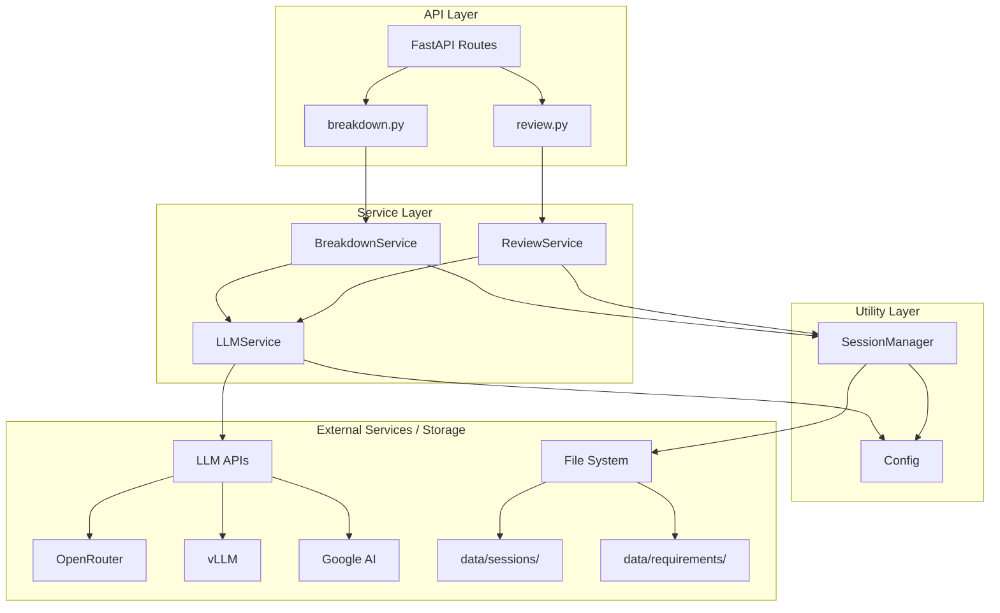
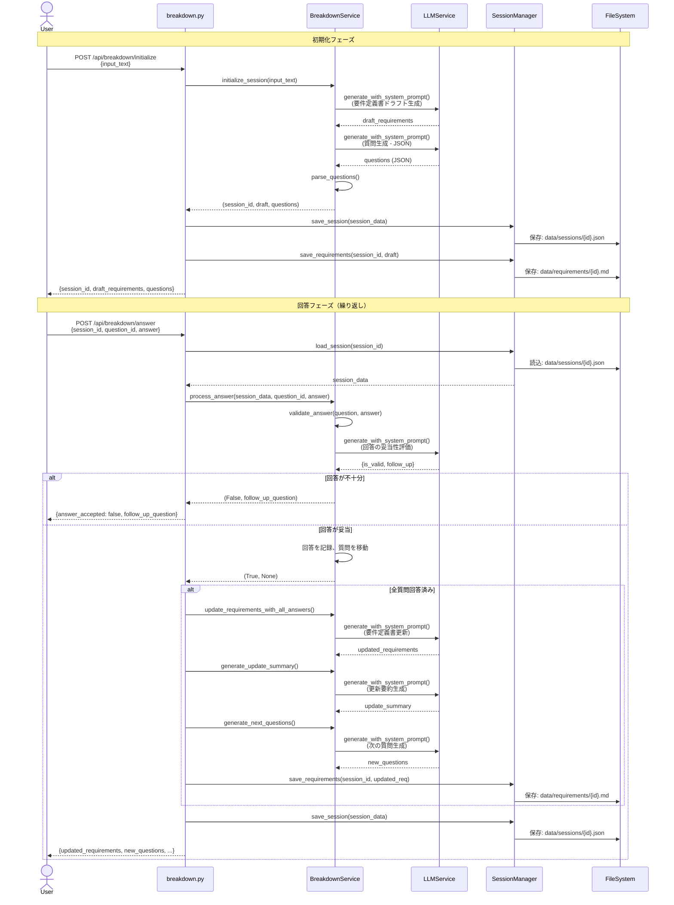

# バックエンド仕様書

## 目次

1. [概要](#概要)
2. [アーキテクチャ](#アーキテクチャ)
3. [API仕様](#api仕様)
4. [LLMサービス詳細](#llmサービス詳細)
5. [ブレークダウンサービス詳細](#ブレークダウンサービス詳細)
6. [レビューサービス詳細](#レビューサービス詳細)
7. [データモデル](#データモデル)
8. [セッション管理](#セッション管理)
9. [設定管理](#設定管理)
10. [プロンプト設計](#プロンプト設計)
11. [エラーハンドリング](#エラーハンドリング)
12. [検証・テスト](#検証テスト)

---

## 概要

このバックエンドは、**要件定義書作成支援AIシステム**のREST APIを提供するFastAPIアプリケーションです。主に以下の2つの機能を提供します：

1. **ブレークダウン機能**: 打ち合わせの記録から要件定義書を段階的に作成
2. **レビュー機能**: 既存の要件定義書を分析し、漏れ・矛盾を指摘

### 技術スタック

- **フレームワーク**: FastAPI 0.104.1
- **Python**: 3.10以上
- **LLM統合**: OpenAI SDK (OpenRouter, vLLM, Google AI Studio対応)
- **データ永続化**: ファイルベース (JSON + Markdown)
- **非同期処理**: asyncio / async-await

### ディレクトリ構成

```
backend/
├── app/
│   ├── main.py                 # FastAPIアプリケーションエントリーポイント
│   ├── api/                    # APIエンドポイント
│   │   ├── breakdown.py        # ブレークダウン機能のAPI
│   │   └── review.py           # レビュー機能のAPI
│   ├── services/               # ビジネスロジック
│   │   ├── llm_service.py      # LLM統合サービス（重要）
│   │   ├── breakdown_service.py # ブレークダウンロジック
│   │   └── review_service.py   # レビューロジック
│   ├── models/                 # データモデル
│   │   └── schemas.py          # Pydanticスキーマ
│   └── utils/                  # ユーティリティ
│       ├── config.py           # 環境設定管理
│       └── session_manager.py  # セッション永続化
├── data/                       # データストレージ
│   ├── sessions/               # セッションJSON
│   └── requirements/           # 要件定義書Markdown
└── requirements.txt            # 依存関係
```

---

## アーキテクチャ

### レイヤー構成



### データフロー（ブレークダウン機能）



---

## API仕様

### ベースURL

```
http://localhost:8001
```

### 共通仕様

- **Content-Type**: `application/json`
- **CORS**: `localhost:3000`, `localhost:3001`, `localhost:3010` を許可
- **エラーレスポンス**: HTTPException (status_code, detail)

---

### ブレークダウンAPI

#### 1. セッション初期化

**エンドポイント**: `POST /api/breakdown/initialize`

**リクエスト**:
```json
{
  "input_text": "打ち合わせの記録やメモ",
  "session_id": null  // オプション（未使用）
}
```

**レスポンス**:
```json
{
  "session_id": "uuid",
  "draft_requirements": "# 要件定義書\n...",
  "questions": [
    {
      "id": "q1",
      "category": "functional",
      "question": "質問文",
      "priority": "high",
      "context": "背景説明"
    }
  ],
  "completion_rate": 0.0,
  "answered_count": 0,
  "total_count": 5,
  "system_message": "質問を5個作成しました..."
}
```

**処理フロー**:
1. `breakdown_service.initialize_session(input_text)` 呼び出し
2. LLM呼び出し①: 要件定義書ドラフト生成
3. LLM呼び出し②: 質問生成（JSON配列）
4. セッションIDをUUIDで生成
5. SessionDataオブジェクトを作成
6. セッション・要件定義書をファイルに保存
7. レスポンス返却

---

#### 2. 質問への回答

**エンドポイント**: `POST /api/breakdown/answer`

**リクエスト**:
```json
{
  "session_id": "uuid",
  "question_id": "q1",
  "answer": "ユーザーの回答"
}
```

**レスポンス（通常時）**:
```json
{
  "updated_requirements": "# 要件定義書\n...",
  "new_questions": [],
  "completion_rate": 20.0,
  "all_answered": false,
  "answered_count": 1,
  "total_count": 5,
  "follow_up_question": null,
  "answer_accepted": true,
  "system_message": null,
  "update_summary": null,
  "next_questions_message": null
}
```

**レスポンス（回答不十分時）**:
```json
{
  "updated_requirements": "...",
  "new_questions": [],
  "completion_rate": 0.0,
  "all_answered": false,
  "answered_count": 0,
  "total_count": 5,
  "follow_up_question": "より具体的な質問文",
  "answer_accepted": false,
  ...
}
```

**レスポンス（全質問回答完了時）**:
```json
{
  "updated_requirements": "更新された要件定義書",
  "new_questions": [
    {"id": "q6", "question": "新しい質問", ...}
  ],
  "completion_rate": 0.0,  // 新ラウンド開始
  "all_answered": true,
  "answered_count": 0,
  "total_count": 3,
  "follow_up_question": null,
  "answer_accepted": true,
  "system_message": "全ての質問に回答いただきました...",
  "update_summary": "- システム概要を明確化しました\n- ...",
  "next_questions_message": "新たに質問を3個作成しました..."
}
```

**処理フロー**:
1. セッションをロード
2. `breakdown_service.process_answer()` 呼び出し
   - `validate_answer()`: 回答の妥当性チェック
   - 不十分 → follow_up_questionを返す
   - 妥当 → 回答を記録、質問を「answered_questions」に移動
3. 全質問回答済みの場合:
   - `update_requirements_with_all_answers()`: 要件定義書一括更新
   - `generate_update_summary()`: 更新要約生成
   - `generate_next_questions()`: 次ラウンドの質問生成
   - answered_questionsをクリア、新質問をquestionsに追加
4. セッション保存
5. レスポンス返却

---

#### 3. セッション状態取得

**エンドポイント**: `GET /api/breakdown/status/{session_id}`

**レスポンス**:
```json
{
  "session_id": "uuid",
  "requirements": "現在の要件定義書",
  "answered_questions": [...],
  "remaining_questions": [...],
  "completion_rate": 40.0
}
```

---

### レビューAPI

#### 要件定義書レビュー

**エンドポイント**: `POST /api/review`

**リクエスト**:
```json
{
  "requirements_text": "# 要件定義書\n..."
}
```

**レスポンス**:
```json
{
  "review_id": "uuid",
  "issues": [
    {
      "severity": "high",
      "category": "missing",
      "section": "非機能要件",
      "line": 50,
      "description": "セキュリティ要件が記載されていません",
      "suggestion": "認証・認可、データ暗号化について記載してください"
    }
  ],
  "completeness_score": 75.0,
  "consistency_score": 90.0,
  "quality_score": 80.0,
  "summary": "全体的な評価サマリー"
}
```

**処理フロー**:
1. `review_service.review_requirements(requirements_text)` 呼び出し
2. LLM呼び出し: レビュー実行（JSON形式でissuesとscoresを返す）
3. JSONパース
4. ReviewIssueオブジェクトに変換
5. レスポンス返却

---

## LLMサービス詳細

### 概要

`LLMService` は、**全てのLLM呼び出しを一元管理する抽象化レイヤー**です。OpenRouter、vLLM、Google AI Studioの3つのプロバイダーをサポートし、統一されたインターフェースを提供します。

ファイル: [`backend/app/services/llm_service.py`](../backend/app/services/llm_service.py)

### 設計思想

1. **プロバイダー抽象化**: 環境変数の切り替えだけでプロバイダーを変更可能
2. **OpenAI互換API**: OpenRouter・vLLMはOpenAI SDK経由で統一
3. **シングルトンパターン**: `llm_service` インスタンスを共有

### 初期化処理

```python
class LLMService:
    def __init__(self):
        self.provider = settings.llm_provider

        if self.provider == "google_ai":
            # Google AI Studio用のクライアント初期化
            import google.generativeai as genai
            genai.configure(api_key=settings.api_key)
            self.google_client = genai.GenerativeModel(settings.model_name)
            self.client = None
        else:
            # OpenRouter/vLLM用のOpenAI互換クライアント
            self.client = AsyncOpenAI(
                api_key=settings.api_key,
                base_url=settings.base_url,
            )
            self.google_client = None

        self.model = settings.model_name
        self.max_tokens = settings.max_tokens
        self.temperature = settings.temperature
```

**ポイント**:
- `settings.llm_provider` で条件分岐
- OpenRouter/vLLMは `AsyncOpenAI` クライアント（`base_url` でエンドポイント切り替え）
- Google AI Studioは独自SDK (`google.generativeai`)

---

### メソッド1: `generate_completion()`

**シグネチャ**:
```python
async def generate_completion(
    messages: List[dict],
    temperature: Optional[float] = None,
    max_tokens: Optional[int] = None,
) -> str
```

**引数**:
- `messages`: メッセージリスト（OpenAI形式）
  ```python
  [
      {"role": "system", "content": "システムプロンプト"},
      {"role": "user", "content": "ユーザープロンプト"}
  ]
  ```
- `temperature`: 温度パラメータ（0.0-1.0、Noneならデフォルト使用）
- `max_tokens`: 最大出力トークン数

**返り値**: LLMが生成したテキスト（str）

**実装の分岐**:

#### OpenRouter/vLLMの場合:
```python
response = await self.client.chat.completions.create(
    model=self.model,
    messages=messages,
    temperature=temperature or self.temperature,
    max_tokens=max_tokens or self.max_tokens,
)
return response.choices[0].message.content
```

#### Google AI Studioの場合:
```python
# メッセージを結合してプロンプト化
prompt = ""
for msg in messages:
    role = msg.get("role", "user")
    content = msg.get("content", "")
    if role == "system":
        prompt += f"System: {content}\n\n"
    elif role == "user":
        prompt += f"User: {content}\n\n"
    elif role == "assistant":
        prompt += f"Assistant: {content}\n\n"

generation_config = genai.GenerationConfig(
    temperature=temperature or self.temperature,
    max_output_tokens=max_tokens or self.max_tokens,
)

response = await self.google_client.generate_content_async(
    prompt,
    generation_config=generation_config,
)
return response.text
```

**重要**: Google AI StudioはOpenAI形式のmessagesをサポートしないため、手動でプロンプト文字列に変換

---

### メソッド2: `generate_with_system_prompt()`

**シグネチャ**:
```python
async def generate_with_system_prompt(
    system_prompt: str,
    user_prompt: str,
    temperature: Optional[float] = None,
    max_tokens: Optional[int] = None,
) -> str
```

**役割**: システムプロンプトとユーザープロンプトを分離して指定できる便利メソッド

**実装**:
```python
messages = [
    {"role": "system", "content": system_prompt},
    {"role": "user", "content": user_prompt},
]
return await self.generate_completion(messages, temperature, max_tokens)
```

**使用例**:
```python
result = await llm_service.generate_with_system_prompt(
    system_prompt="あなたは優秀なシステムエンジニアです。",
    user_prompt="以下の打ち合わせ記録から要件定義書を作成してください。\n...",
    temperature=0.7,
)
```

---

### 設定パラメータ

LLMServiceは以下の設定値を使用します（`settings.py` から取得）:

| パラメータ | 説明 | デフォルト値 |
|----------|------|------------|
| `llm_provider` | プロバイダー選択 | `"openrouter"` |
| `model_name` | モデル名 | `"qwen/qwen-2.5-coder-32b-instruct"` |
| `max_tokens` | 最大出力トークン数 | `4096` |
| `temperature` | 温度パラメータ | `0.7` |
| `api_key` | APIキー | プロバイダーに応じて選択 |
| `base_url` | APIエンドポイント | プロバイダーに応じて選択 |

---

### プロバイダー別設定

#### OpenRouter（開発・テスト推奨）

```env
LLM_PROVIDER=openrouter
OPENROUTER_API_KEY=sk-or-...
OPENROUTER_MODEL=qwen/qwen-2.5-coder-32b-instruct
OPENROUTER_BASE_URL=https://openrouter.ai/api/v1
```

**特徴**:
- 複数のLLMモデルを試せる
- APIキーのみで即座に使用可能
- 従量課金

**推奨モデル**:
- `qwen/qwen-2.5-coder-32b-instruct`: コーディング特化、日本語対応
- `anthropic/claude-3.5-sonnet`: 高品質な推論

---

#### vLLM（本番環境推奨）

```env
LLM_PROVIDER=vllm
VLLM_API_BASE=http://localhost:8000/v1
VLLM_MODEL=Qwen/Qwen2.5-Coder-32B-Instruct
VLLM_API_KEY=  # 空でOK（ローカル環境）
```

**特徴**:
- 自前でモデルをホスティング
- OpenAI互換API
- 高速推論（GPU活用）

**セットアップ例**:
```bash
# vLLMサーバーを起動
python -m vllm.entrypoints.openai.api_server \
  --model Qwen/Qwen2.5-Coder-32B-Instruct \
  --port 8000
```

---

#### Google AI Studio

```env
LLM_PROVIDER=google_ai
GOOGLE_AI_API_KEY=AIzaSy...
GOOGLE_AI_MODEL=gemini-2.0-flash-exp
```

**特徴**:
- Googleの最新モデル（Gemini）
- 無料枠が豊富
- 独自SDK使用

---

### エラーハンドリング

```python
try:
    response = await self.client.chat.completions.create(...)
    return response.choices[0].message.content
except Exception as e:
    raise Exception(f"LLM生成エラー: {str(e)}")
```

**エラー種別**:
- ネットワークエラー
- APIキー認証エラー
- レート制限エラー
- タイムアウト

全て `Exception` として上位レイヤーに伝播（HTTPException 500に変換される）

---

## ブレークダウンサービス詳細

### 概要

`BreakdownService` は、打ち合わせ記録から要件定義書を段階的に作成するビジネスロジックを実装します。

ファイル: [`backend/app/services/breakdown_service.py`](../backend/app/services/breakdown_service.py)

### システムプロンプト

```python
SYSTEM_PROMPT = """あなたは優秀なシステムエンジニアであり、要件定義のエキスパートです。
ユーザーから提供される打ち合わせの記録や議事録を分析し、要件定義書を作成します。

あなたの役割：
1. 入力されたテキストから要件を抽出し、構造化された要件定義書を作成する
2. 不明瞭な点や不足している情報について、的確な質問を生成する
3. ユーザーの回答を受けて、要件定義書を段階的に改善する

要件定義書のフォーマット：
- マークダウン形式
- 以下のセクションを含める：
  1. システム概要
  2. 目的・背景
  3. 対象ユーザー
  4. 機能要件
  5. 非機能要件
  6. 制約条件
  7. 前提条件

質問生成のガイドライン：
- 具体的で明確な質問をする
- エラーハンドリング、セキュリティ、パフォーマンスなどの非機能要件も考慮する
- 優先度を適切に設定する（High/Medium/Low）
"""
```

**ポイント**:
- AIの役割を明確に定義
- 要件定義書のフォーマットを指定
- 質問生成のガイドラインを含む

---

### メソッド1: `initialize_session()`

**役割**: セッションを初期化し、要件定義書のドラフトと初回質問を生成

**シグネチャ**:
```python
async def initialize_session(input_text: str) -> Tuple[str, str, List[Question]]
```

**引数**:
- `input_text`: 打ち合わせの記録

**返り値**:
- `session_id`: UUID文字列
- `draft_requirements`: 要件定義書のドラフト（Markdown）
- `questions`: 質問リスト

**処理フロー**:

#### ステップ1: 要件定義書ドラフト生成

**プロンプト**:
```python
draft_prompt = f"""以下の打ち合わせの記録から、要件定義書のたたき台を作成してください。

【打ち合わせの記録】
{input_text}

【指示】
マークダウン形式で以下のセクションを含む要件定義書を作成してください：

## 1. システム概要
- システムの名称と種類（Webアプリ、モバイルアプリ、API等）を明記
- 一言でシステムの目的を説明（「〜するためのシステム」形式）
- 主要な機能を3〜5個、箇条書きで列挙

## 2. 目的・背景
- このシステムが解決する課題・問題点を具体的に記載
- システム導入により期待される効果・メリットを明示
- 現状のフロー（As-Is）と理想のフロー（To-Be）の違いがあれば記載

## 3. 対象ユーザー
- 想定ユーザーの属性（職種、役割、ITリテラシー等）を具体的に記載
- ユーザー数の規模（概算でも可）
- 複数のユーザー種別がある場合は区別して記載（例：管理者、一般ユーザー、ゲスト）

## 4. 機能要件
- 機能ごとに見出し（###）を分けて構造化
- 各機能について以下を記載：
  - 機能の目的と概要
  - 主要な操作フロー（誰が、何を、どうする）
  - 入力項目と出力結果
  - 特筆すべき仕様や制約
- 優先度が明確な場合は記載（必須/推奨/将来対応等）

## 5. 非機能要件
以下の観点から記載（情報があれば）：
- **パフォーマンス**: 応答時間、同時アクセス数、データ量等の性能要件
- **セキュリティ**: 認証・認可、データ保護、暗号化等の要件
- **可用性**: 稼働時間、障害復旧時間等
- **拡張性**: 将来的な機能追加やユーザー増加への対応
- **保守性**: ログ、監視、バックアップ等
- **ユーザビリティ**: UI/UXの方針、アクセシビリティ要件

## 6. 制約条件
- 技術的制約（使用技術、プラットフォーム、既存システムとの連携等）
- ビジネス上の制約（予算、納期、人員体制等）
- 法的・規制上の制約（個人情報保護法、業界規制等）
- 運用上の制約（運用時間、保守体制等）

## 7. 前提条件
- システム構築・運用の前提となる環境や条件
- 利用可能なインフラ・ツール
- 既存システムとの関係性
- ユーザーに求められる環境（ブラウザ、OS、ネットワーク等）

【重要な作成ルール】
1. **具体性を重視**: 曖昧な表現を避け、定量的・具体的に記述する
   - 悪い例：「高速に動作する」
   - 良い例：「検索結果を3秒以内に表示する」

2. **実装可能性を意識**: 開発者が実装をイメージできるレベルの詳細度で記述

3. **不明点の明示**: 情報が不足している箇所は明確に「TODO: 〜を確認」「要確認: 〜の詳細」と記載
   - 単に「TODO」だけでなく、何を確認すべきかを明記する

4. **一貫性の確保**: セクション間で矛盾がないように注意
   - 例：機能要件で「予約機能」と記載したら、システム概要にも反映

5. **構造化**: 箇条書き、表、見出しを活用して読みやすく整理

要件定義書のみを出力してください。他の説明は不要です。
"""
```

**LLM呼び出し**:
```python
draft_requirements = await llm_service.generate_with_system_prompt(
    system_prompt=self.SYSTEM_PROMPT,
    user_prompt=draft_prompt,
)
```

**温度パラメータ**: デフォルト（0.7）
**理由**: ある程度の創造性が必要（ドラフト生成）

---

#### ステップ2: 質問生成

**プロンプト**:
```python
questions_prompt = f"""以下の打ち合わせの記録と要件定義書のたたき台を見て、要件を明確にするための質問を生成してください。

【打ち合わせの記録】
{input_text}

【要件定義書のたたき台】
{draft_requirements}

【質問作成のルール】
1. **1つの質問には1つの観点のみ**：複数の観点を1つの質問にまとめない
2. **簡潔で明確**：「例:」や括弧での補足説明は最小限にする
3. **具体的**：曖昧な表現を避け、何を知りたいのか明確にする
4. **優先度付け**：重要な質問から順に生成する

【指示】
- 不明瞭な点や不足している情報について質問する
- エラーハンドリング、セキュリティ、パフォーマンスなどの非機能要件も考慮
- **重要度の高い質問に絞り込み、最大{settings.max_questions}個程度にする**
- 各質問について以下の情報を含める：
  - id: 一意の識別子（q1, q2, ...）
  - category: 必ず次のいずれかを使用 → functional, non_functional, constraint, other
  - question: 質問文（簡潔に1文で）
  - priority: 必ず次のいずれかを使用 → high, medium, low
  - context: 質問の背景（省略可）

**悪い例**：
「本の予約機能について、予約待ちの管理方法（優先順位、キャンセル時の扱い、有効期限）や、受け渡しフロー（通知方法、受け取り方法）の詳細を教えてください。」
→ 複数の観点が混在している

**良い例**：
- 「予約待ちの管理方法として、複数人が予約した場合の優先順位はどのように決めますか？」
- 「予約の有効期限はありますか？」
- 「予約した本が返却されたとき、どのように予約者に通知しますか？」

**重要**: categoryは必ず "functional", "non_functional", "constraint", "other" のいずれか、priorityは必ず "high", "medium", "low" のいずれかを使用してください。

JSON形式で出力してください：
```json
[
  {
    "id": "q1",
    "category": "functional",
    "question": "質問文",
    "priority": "high",
    "context": "背景説明"
  }
]
```

JSON配列のみを出力してください。他の説明は不要です。
"""
```

**LLM呼び出し**:
```python
questions_json = await llm_service.generate_with_system_prompt(
    system_prompt=self.SYSTEM_PROMPT,
    user_prompt=questions_prompt,
    temperature=0.5,  # 構造化された出力のため低めに設定
)
```

**温度パラメータ**: 0.5
**理由**: JSON形式の構造化出力が必要

**JSONパース**:
```python
questions = self._parse_questions(questions_json)
```

`_parse_questions()` メソッド:
- コードブロック（```json）を除去
- JSONデコード
- categoryとpriorityのバリデーション（不正な値は修正）
- `Question` オブジェクトに変換

---

#### ステップ3: セッションID生成

```python
session_id = str(uuid.uuid4())
return session_id, draft_requirements, questions
```

---

### メソッド2: `validate_answer()`

**役割**: ユーザーの回答が質問に対して適切かどうかをLLMで評価

**シグネチャ**:
```python
async def validate_answer(
    question: str,
    answer: str,
    conversation_history: Optional[List[Tuple[str, str]]] = None,
) -> Tuple[bool, Optional[str]]
```

**引数**:
- `question`: 質問文
- `answer`: ユーザーの回答
- `conversation_history`: これまでのQ&A履歴（追加質問対応）

**返り値**:
- `is_valid`: 回答が妥当ならTrue
- `follow_up_question`: 不十分な場合の追加質問（妥当な場合はNone）

**プロンプト**:
```python
validation_prompt = f"""以下の質問と回答を評価してください。
{history_text}  # 会話履歴があれば含める

【今回の質問】
{question}

【今回の回答】
{answer}

【評価基準】
1. 回答が質問に対して直接的に答えているか
2. 回答が具体的で実装可能な内容か、または「未確定」「不明」「決まっていない」と明示されているか
3. 回答が曖昧でないか
4. **会話履歴がある場合、前回の回答と組み合わせて評価する**（今回の回答は前回の補足として扱う）

【指示】
回答を評価し、以下のJSON形式で出力してください：

- 回答が妥当な場合（具体的な回答、または「未確定」「不明」「決まっていない」と明示している場合）：
```json
{"is_valid": true, "reason": "評価理由"}
```

- 回答が不十分な場合（言い換えた追加質問を含める）：
```json
{"is_valid": false, "reason": "不十分な理由", "follow_up": "言い換えた質問文（より具体的で答えやすく）"}
```

**重要**：
- 「未確定」「不明」「決まっていない」「まだ決まっていない」などの回答はis_valid=true（現段階で決まっていないことを明示しているため）
- 「特になし」「任せます」など、検討したのか不明な曖昧な回答はis_valid=false
- 質問に対して何も答えていない場合はis_valid=false
- 追加質問は元の質問を言い換えて、より答えやすくする

JSON形式のみを出力してください。
"""
```

**LLM呼び出し**:
```python
response_json = await llm_service.generate_with_system_prompt(
    system_prompt=self.SYSTEM_PROMPT,
    user_prompt=validation_prompt,
    temperature=0.3,  # 評価タスクのため低めに設定
)
```

**JSONパース**:
```python
result = json.loads(response_json)
is_valid = result.get("is_valid", True)
follow_up = result.get("follow_up", None)
return is_valid, follow_up
```

**エラー処理**: JSONパースに失敗した場合は `(True, None)` を返す（フォールバック）

---

### メソッド3: `process_answer()`

**役割**: 質問への回答を記録し、妥当性をチェック

**シグネチャ**:
```python
async def process_answer(
    session_data: SessionData,
    question_id: str,
    answer: str,
) -> Tuple[bool, Optional[str]]
```

**処理フロー**:
1. 該当する質問を `session_data.questions` から検索
2. 会話履歴を構築（回答済み質問 + 現在の質問の過去回答）
3. `validate_answer()` を呼び出し
4. **妥当な場合**:
   - 回答を `session_data.answers` に記録
   - 質問を `questions` から削除し `answered_questions` に移動
   - `(True, None)` を返す
5. **不十分な場合**:
   - 回答を一時的に `session_data.answers` に記録（次回参照用）
   - 質問は削除しない
   - `(False, follow_up_question)` を返す

---

### メソッド4: `update_requirements_with_all_answers()`

**役割**: 全ての回答を反映して要件定義書を一括更新

**シグネチャ**:
```python
async def update_requirements_with_all_answers(
    session_data: SessionData,
) -> str
```

**プロンプト**:
```python
update_prompt = f"""以下の要件定義書を、全てのユーザー回答に基づいて更新してください。

【現在の要件定義書】
{session_data.requirements}

【全ての質問と回答】
{qa_text}  # 全Q&Aをまとめたテキスト

【指示】
- 全てのユーザー回答を要件定義書に反映する
- 関連する「TODO」や「要確認」を具体的な内容に置き換える
- 新しい情報を適切なセクションに追加する
- マークダウン形式を維持する
- 矛盾がないように注意する
- 回答の内容を統合して、一貫性のある要件定義書にする

更新された要件定義書のみを出力してください。他の説明は不要です。
"""
```

**LLM呼び出し**:
```python
updated_requirements = await llm_service.generate_with_system_prompt(
    system_prompt=self.SYSTEM_PROMPT,
    user_prompt=update_prompt,
)
return updated_requirements
```

---

### メソッド5: `generate_update_summary()`

**役割**: 要件定義書の更新要点を生成

**プロンプト**:
```python
summary_prompt = f"""以下のユーザー回答に基づいて、要件定義書をどのように更新したかを簡潔に要約してください。

【ユーザーの回答】
{qa_text}

【指示】
- 更新した主要なポイントを3〜5個の箇条書きで記載
- 各ポイントは1文で簡潔に
- 「〜を明確化しました」「〜を追加しました」のような形式で
- マークダウン形式の箇条書きで出力

例：
- システム概要として社内書籍管理システムであることを明確化しました
- 対象ユーザーを全社員（約100名）と明記しました
- 予算を200万円以内、納期を3ヶ月後と設定しました
"""
```

**LLM呼び出し**:
```python
update_summary = await llm_service.generate_with_system_prompt(
    system_prompt=self.SYSTEM_PROMPT,
    user_prompt=summary_prompt,
    temperature=0.3,
)
return update_summary.strip()
```

---

### メソッド6: `generate_next_questions()`

**役割**: 要件定義書更新後に新しい質問を生成

**プロンプト**:
```python
new_questions_prompt = f"""以下の要件定義書を見て、まだ明確でない点や追加で確認すべき点について質問を生成してください。

【要件定義書】
{updated_requirements}

【これまでの質問と回答の履歴】
{qa_history}

【質問作成のルール】
1. **1つの質問には1つの観点のみ**：複数の観点を1つの質問にまとめない
2. **簡潔で明確**：「例:」や括弧での補足説明は最小限にする
3. **具体的**：曖昧な表現を避け、何を知りたいのか明確にする
4. **優先度付け**：重要な質問から順に生成する

【指示】
- 既に明確になった点については質問しない
- 要件定義書の品質を高めるための追加質問をする
- **重要度の高い質問に絞り込み、最大{settings.max_questions}個程度にする**
- categoryは必ず "functional", "non_functional", "constraint", "other" のいずれかを使用
- priorityは必ず "high", "medium", "low" のいずれかを使用
- 要件が十分に明確で追加質問が不要な場合は空の配列を返す

JSON形式で出力してください：
...

質問がない場合は空の配列 [] を返してください。
JSON配列のみを出力してください。他の説明は不要です。
"""
```

**LLM呼び出し**:
```python
new_questions_json = await llm_service.generate_with_system_prompt(
    system_prompt=self.SYSTEM_PROMPT,
    user_prompt=new_questions_prompt,
    temperature=0.5,
)
new_questions = self._parse_questions(new_questions_json)
return new_questions
```

**重要**: 質問がない場合は空の配列 `[]` が返される（要件定義完了）

---

### メソッド7: `calculate_completion_rate()`

**役割**: 要件の充足率を計算

**実装**:
```python
def calculate_completion_rate(session_data: SessionData) -> float:
    total_questions = len(session_data.answered_questions) + len(session_data.questions)
    if total_questions == 0:
        return 100.0

    answered = len(session_data.answered_questions)
    return (answered / total_questions) * 100
```

**計算式**: `(回答済み質問数 / 総質問数) × 100`

---

## レビューサービス詳細

### 概要

`ReviewService` は、要件定義書を分析し、漏れ・矛盾・曖昧な表現を指摘します。

ファイル: [`backend/app/services/review_service.py`](../backend/app/services/review_service.py)

### システムプロンプト

```python
SYSTEM_PROMPT = """あなたは優秀なシステムエンジニアであり、要件定義のレビューエキスパートです。
要件定義書を分析し、漏れ・矛盾・曖昧な表現を指摘します。

レビューの観点：
1. **必須項目の確認**: システム概要、目的、機能要件、非機能要件などが含まれているか
2. **整合性チェック**: 機能間の矛盾、データの整合性などをチェック
3. **漏れチェック**: エラーハンドリング、セキュリティ、パフォーマンス、バックアップ等の漏れ
4. **品質チェック**: 曖昧な表現、定量化されていない要件の検出

指摘の重大度：
- High: 致命的な漏れや矛盾、セキュリティリスク
- Medium: 重要だが致命的ではない漏れ、明確化が必要な点
- Low: 改善推奨事項、用語の統一など
"""
```

---

### メソッド: `review_requirements()`

**シグネチャ**:
```python
async def review_requirements(requirements_text: str) -> tuple[List[ReviewIssue], dict]
```

**プロンプト**:
```python
review_prompt = f"""以下の要件定義書をレビューし、漏れ・矛盾・曖昧な表現を指摘してください。

【要件定義書】
{requirements_text}

【指示】
各指摘について以下の情報を含めてください：
- severity: high, medium, low
- category: missing, inconsistency, ambiguity, quality
- section: 該当セクション名
- line: 該当行番号（推定可能な場合）
- description: 指摘内容の説明
- suggestion: 具体的な改善提案

JSON形式で出力してください：
```json
{
  "issues": [
    {
      "severity": "high",
      "category": "missing",
      "section": "セクション名",
      "line": 10,
      "description": "指摘内容",
      "suggestion": "改善提案"
    }
  ],
  "completeness_score": 75.0,
  "consistency_score": 90.0,
  "quality_score": 80.0,
  "summary": "全体的な評価サマリー"
}
```

JSON形式で出力してください。他の説明は不要です。
"""
```

**LLM呼び出し**:
```python
review_json = await llm_service.generate_with_system_prompt(
    system_prompt=self.SYSTEM_PROMPT,
    user_prompt=review_prompt,
    temperature=0.3,  # 評価タスクのため低めに設定
)
```

**返り値**:
```python
issues = [ReviewIssue(**issue) for issue in review_data.get("issues", [])]
scores = {
    "completeness_score": review_data.get("completeness_score", 0.0),
    "consistency_score": review_data.get("consistency_score", 0.0),
    "quality_score": review_data.get("quality_score", 0.0),
    "summary": review_data.get("summary", ""),
}
return issues, scores
```

---

## データモデル

### Question

```python
class Question(BaseModel):
    id: str  # 例: "q1"
    category: Literal["functional", "non_functional", "constraint", "other"]
    question: str
    priority: Literal["high", "medium", "low"]
    context: Optional[str] = None
```

---

### SessionData（内部用）

```python
class SessionData(BaseModel):
    session_id: str
    input_text: str  # 元の打ち合わせ記録
    requirements: str  # 現在の要件定義書
    questions: List[Question]  # 未回答の質問
    answered_questions: List[Question]  # 回答済みの質問
    answers: dict[str, str]  # question_id -> answer
    completion_rate: float  # 充足率（0-100）
```

---

### ReviewIssue

```python
class ReviewIssue(BaseModel):
    severity: Literal["high", "medium", "low"]
    category: Literal["missing", "inconsistency", "ambiguity", "quality"]
    section: str
    line: Optional[int] = None
    description: str
    suggestion: str
```

---

## セッション管理

### 概要

`SessionManager` は、セッションデータと要件定義書をファイルシステムに永続化します。

ファイル: [`backend/app/utils/session_manager.py`](../backend/app/utils/session_manager.py)

### ディレクトリ構成

```
data/
├── sessions/
│   ├── {session_id}.json
│   └── ...
└── requirements/
    ├── {session_id}.md
    └── ...
```

### メソッド

#### 1. `save_session(session_data: SessionData)`

**実装**:
```python
session_file = self.sessions_dir / f"{session_data.session_id}.json"
with open(session_file, "w", encoding="utf-8") as f:
    json.dump(session_data.model_dump(), f, ensure_ascii=False, indent=2)
```

**ファイル形式**: JSON（UTF-8、インデント2）

---

#### 2. `load_session(session_id: str) -> Optional[SessionData]`

**実装**:
```python
session_file = self.sessions_dir / f"{session_id}.json"
if not session_file.exists():
    return None

with open(session_file, "r", encoding="utf-8") as f:
    data = json.load(f)
    return SessionData(**data)
```

---

#### 3. `save_requirements(session_id: str, requirements: str) -> str`

**実装**:
```python
req_file = self.requirements_dir / f"{session_id}.md"
with open(req_file, "w", encoding="utf-8") as f:
    f.write(requirements)
return str(req_file)
```

**ファイル形式**: Markdown（UTF-8）

---

#### 4. `load_requirements(session_id: str) -> Optional[str]`

**実装**:
```python
req_file = self.requirements_dir / f"{session_id}.md"
if not req_file.exists():
    return None

with open(req_file, "r", encoding="utf-8") as f:
    return f.read()
```

---

## 設定管理

### 概要

`Settings` は、環境変数からアプリケーション設定をロードします。

ファイル: [`backend/app/utils/config.py`](../backend/app/utils/config.py)

### 設定項目

| 設定項目 | 型 | デフォルト値 | 説明 |
|---------|---|------------|------|
| `llm_provider` | `Literal["openrouter", "vllm", "google_ai"]` | `"openrouter"` | LLMプロバイダー選択 |
| `openrouter_api_key` | `str` | `""` | OpenRouter APIキー |
| `openrouter_model` | `str` | `"qwen/qwen-2.5-coder-32b-instruct"` | OpenRouterモデル名 |
| `openrouter_base_url` | `str` | `"https://openrouter.ai/api/v1"` | OpenRouter エンドポイント |
| `vllm_api_base` | `str` | `"http://localhost:8000/v1"` | vLLM エンドポイント |
| `vllm_model` | `str` | `"Qwen/Qwen2.5-Coder-32B-Instruct"` | vLLM モデル名 |
| `vllm_api_key` | `str` | `""` | vLLM APIキー（通常不要） |
| `google_ai_api_key` | `str` | `""` | Google AI Studio APIキー |
| `google_ai_model` | `str` | `"gemini-2.0-flash-exp"` | Google AI モデル名 |
| `data_dir` | `str` | `"../data"` | データ保存ディレクトリ |
| `max_tokens` | `int` | `4096` | 最大出力トークン数 |
| `temperature` | `float` | `0.7` | デフォルト温度パラメータ |
| `max_questions` | `int` | `15` | 生成する質問の最大数 |

### プロパティ

#### `api_key`

```python
@property
def api_key(self) -> str:
    if self.llm_provider == "openrouter":
        return self.openrouter_api_key
    elif self.llm_provider == "google_ai":
        return self.google_ai_api_key
    return self.vllm_api_key
```

#### `base_url`

```python
@property
def base_url(self) -> str:
    if self.llm_provider == "openrouter":
        return self.openrouter_base_url
    return self.vllm_api_base
```

#### `model_name`

```python
@property
def model_name(self) -> str:
    if self.llm_provider == "openrouter":
        return self.openrouter_model
    elif self.llm_provider == "google_ai":
        return self.google_ai_model
    return self.vllm_model
```

---

## プロンプト設計

### 設計原則

1. **役割定義**: システムプロンプトでAIの役割を明確化
2. **構造化**: セクション分けで情報を整理（【】で区切る）
3. **具体例**: 良い例・悪い例を示す
4. **制約明示**: 出力形式を厳格に指定（「JSON配列のみ」など）
5. **温度調整**: タスクに応じて温度パラメータを変更

### 温度パラメータの使い分け

| タスク | 温度 | 理由 |
|-------|-----|------|
| 要件定義書ドラフト生成 | 0.7 | 創造性が必要 |
| 質問生成 | 0.5 | 構造化出力だが多様性も必要 |
| 回答の妥当性評価 | 0.3 | 一貫性が重要 |
| 要件定義書更新 | 0.7 | 統合・整理に創造性が必要 |
| 更新要約生成 | 0.3 | 簡潔さが重要 |
| レビュー | 0.3 | 評価の一貫性が重要 |

### JSON出力の安定化テクニック

1. **明示的な指示**: 「JSON配列のみを出力してください。他の説明は不要です。」
2. **例示**: 完全なJSON例を示す
3. **パース時の前処理**: コードブロック（```json）を除去
4. **バリデーション**: 不正な値をフォールバック（例: 不正なcategoryを"other"に置き換え）
5. **エラー処理**: JSONパース失敗時のデフォルト値を設定

### プロンプトの構造化パターン

```
【コンテキスト】
- 入力データを提示

【ルール】
- 1. ルール1
- 2. ルール2

【指示】
- 具体的なタスク
- 出力形式の指定

【例】
良い例：...
悪い例：...

【出力形式】
```json
{...}
```

JSONのみを出力してください。
```

---

## エラーハンドリング

### レイヤー別エラー処理

#### 1. LLMServiceレベル

```python
try:
    response = await self.client.chat.completions.create(...)
    return response.choices[0].message.content
except Exception as e:
    raise Exception(f"LLM生成エラー: {str(e)}")
```

**戦略**: 全てのエラーを `Exception` として上位に伝播

---

#### 2. Serviceレベル

```python
try:
    questions = self._parse_questions(questions_json)
except Exception as e:
    print(f"質問パースエラー: {e}")
    return []  # 空の配列を返す（フォールバック）
```

**戦略**:
- パース失敗時はデフォルト値を返す
- ログ出力（print）

---

#### 3. APIレベル

```python
try:
    session_data = session_manager.load_session(request.session_id)
    if not session_data:
        raise HTTPException(status_code=404, detail="セッションが見つかりません")

    # ビジネスロジック
    ...

except HTTPException:
    raise  # HTTPExceptionはそのまま再送出
except Exception as e:
    import traceback
    error_detail = f"回答処理エラー: {str(e)}\n{traceback.format_exc()}"
    print(error_detail)
    raise HTTPException(status_code=500, detail=f"回答処理エラー: {str(e)}")
```

**戦略**:
- HTTPExceptionはそのまま再送出
- その他の例外は500エラーに変換
- トレースバックをログ出力

---

### エラーレスポンス例

```json
{
  "detail": "セッションが見つかりません"
}
```

```json
{
  "detail": "回答処理エラー: LLM生成エラー: APIキーが無効です"
}
```

---

## 検証・テスト

### 単体テストの推奨

#### LLMServiceのモック

```python
import pytest
from unittest.mock import AsyncMock, patch

@pytest.mark.asyncio
async def test_breakdown_initialize():
    with patch("app.services.llm_service.llm_service.generate_with_system_prompt") as mock_llm:
        mock_llm.side_effect = [
            "# 要件定義書\n...",  # ドラフト
            '[{"id": "q1", "category": "functional", ...}]',  # 質問JSON
        ]

        session_id, draft, questions = await breakdown_service.initialize_session("テスト")

        assert len(questions) > 0
        assert "要件定義書" in draft
```

---

### 手動テストのチェックリスト

#### ブレークダウン機能

1. [ ] セッション初期化が正常に動作する
2. [ ] 質問生成が適切（1つの観点につき1質問）
3. [ ] 回答の妥当性評価が機能する（不十分な回答を検出）
4. [ ] 全質問回答後に要件定義書が更新される
5. [ ] 次ラウンドの質問が生成される
6. [ ] 質問がない場合は空配列が返される

#### レビュー機能

1. [ ] 漏れを検出できる（セキュリティ、エラーハンドリングなど）
2. [ ] 矛盾を検出できる
3. [ ] 曖昧な表現を検出できる
4. [ ] スコアが妥当な範囲（0-100）

---

### プロンプトのA/Bテスト

プロンプトを変更した場合、以下の観点で比較検証してください：

1. **出力の品質**: 要件定義書の網羅性・具体性
2. **JSON安定性**: パースエラーの発生率
3. **質問の質**: 1質問1観点、簡潔さ、具体性
4. **温度パラメータの影響**: 0.3, 0.5, 0.7 で比較

---

## まとめ

このバックエンドは、**LLMを活用した要件定義支援システム**として、以下の特徴を持ちます：

1. **プロバイダー抽象化**: OpenRouter、vLLM、Google AI Studioを統一インターフェースで扱う
2. **プロンプトエンジニアリング**: システムプロンプト、構造化プロンプト、温度調整を駆使
3. **インタラクティブな改善**: 回答の妥当性評価→追加質問→要件定義書更新のループ
4. **ファイルベース永続化**: セッションJSONと要件定義書Markdownを保存

### 重要な検証ポイント

- **LLMの出力品質**: プロンプトの微調整が必要
- **JSON安定性**: パース失敗時のフォールバック処理
- **回答評価の精度**: validate_answer()の判定基準

### 今後の拡張予定

- GraphRAG統合（Phase 2）
- Git連携（自動コミット）
- マルチラウンド最適化（質問数の動的調整）
